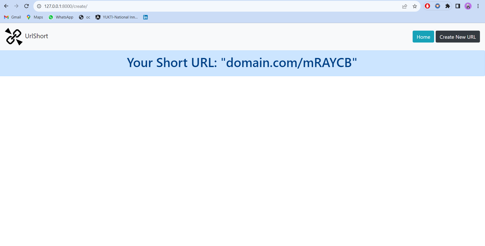

# LinkLoom - A Django URL Shortener


LinkLoom is a Django-based URL shortening tool that simplifies the process of converting long, cumbersome URLs into short and manageable links. With LinkLoom, you can take a long URL and generate a compact, easy-to-share short URL. Users can then simply click on the shortened link and be redirected to the original destination.

## Features

- **URL Shortening**: Quickly and easily shorten long URLs.
- **Customizable Short URLs**: Create custom short links for easy branding.
- **Redirect Services**: Seamless redirection from short URL to original destination.
- **User-Friendly Interface**: An intuitive and user-friendly web interface.
- **Data Analytics**: Track link usage and analytics with detailed statistics.
- **Secure and Reliable**: LinkLoom ensures the safety and reliability of your links.
  





### Prerequisites

- Python 3.10
- Django

Clone the repository:

   ```bash
   git clone https://github.com/PraveenRajuKhasha/linkloom.git

